# Práctica 1 - Introducción a Unity y C#
**Asignatura:** Interfaces Inteligentes  
**Alumno:** Diego García Hernández

## Descripción
Este repositorio contiene la primera práctica de la asignatura, donde se abordan conceptos básicos de Unity mediante 13 ejercicios prácticos: manipulación de componentes, uso de la clase Math, operaciones espaciales con vectores (Vector3), búsqueda de GameObjects mediante etiquetas (Tags) y gestión de Inputs y físicas básicas de movimiento (Translate, Time.deltaTime, LookAt).

---

## Hitos de la Práctica

### Hito 1: Cambio de color aleatorio
Se ha creado un script `CambiadorDeColor` asignado a un cubo. El script genera un color aleatorio modificando un canal del vector RGB cada N frames (parametrizable desde el inspector usando variables públicas).  
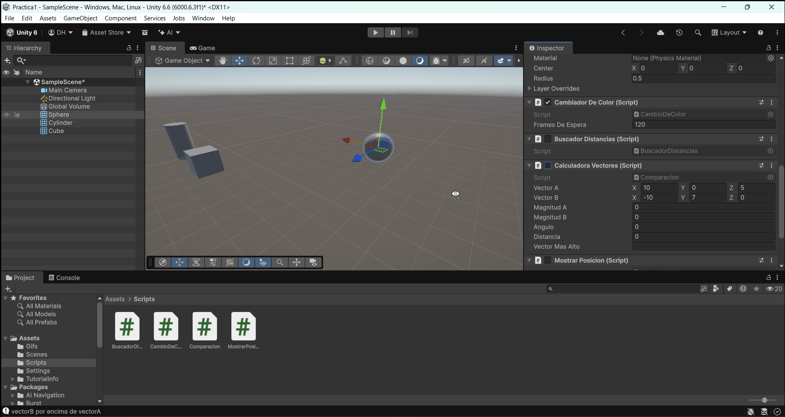

### Hito 2: Calculadora de Vectores (Vector3)
Script asociado a una esfera que toma dos variables `Vector3` públicas dadas desde el Inspector. Calcula y muestra por consola y en el propio inspector la magnitud de ambos, el ángulo que forman, la distancia entre ellos y cuál se encuentra a mayor altura (eje Y).  
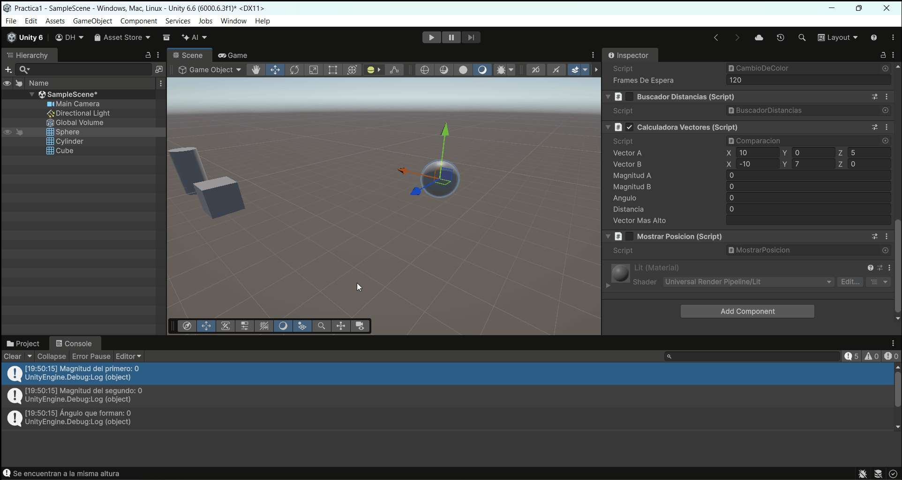

### Hito 3: Posición en el mundo
Se ha utilizado el atajo `transform.position` dentro de la esfera para leer las coordenadas exactas donde está situada en la escena y mostrarlas a través de la consola mediante `Debug.Log`.  
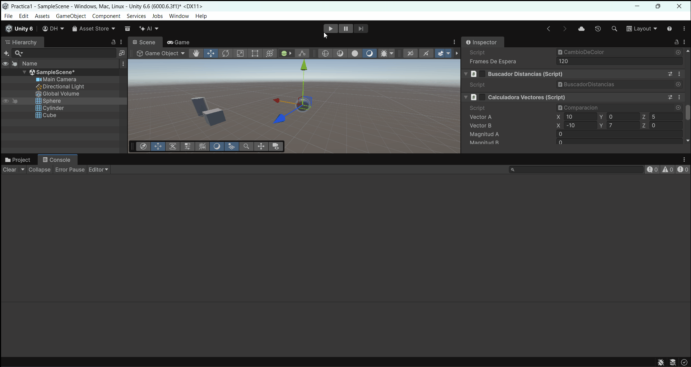

### Hito 4: Búsqueda por Etiquetas (Tags) y distancias
En este ejercicio, el script de la esfera busca a otros dos objetos en la escena (un cubo y un cilindro) utilizando `GameObject.FindWithTag()`. Una vez localizados, accede a sus componentes Transform para calcular y mostrar por consola la distancia a la que se encuentran respecto a la esfera.  
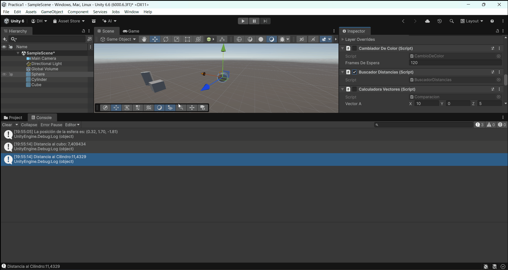

### Hito 5: Desplazamiento mediante Input
Se configuró una escena con tres objetos. Mediante un script, se guarda su posición inicial y, al pulsar la barra espaciadora (`Input.GetAxis("Jump")`), los objetos se desplazan sumando un vector de desplazamiento configurado públicamente desde el Inspector.  
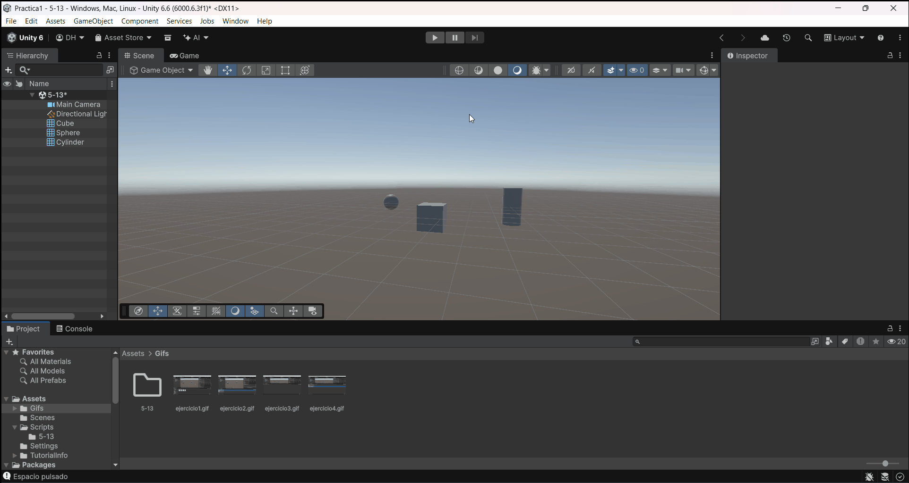

### Hito 6: Detección de teclas y Ejes
Se añadió un campo `velocidad` al cubo. El script lee las teclas de las flechas pulsadas usando `Input.GetKey()` y muestra en consola el nombre de la tecla junto con el resultado de multiplicar la velocidad por el valor de los ejes `Horizontal` o `Vertical`.  
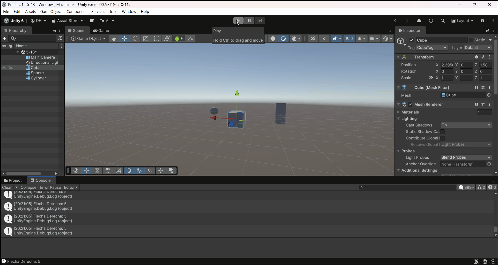

### Hito 7: Mapeo de Input Manager (Eje Disparo)
Se configuró el *Input Manager* de Unity (antiguo sistema de entrada) para mapear la tecla `H` a la función/eje por defecto de "disparo" (`Fire1`).  
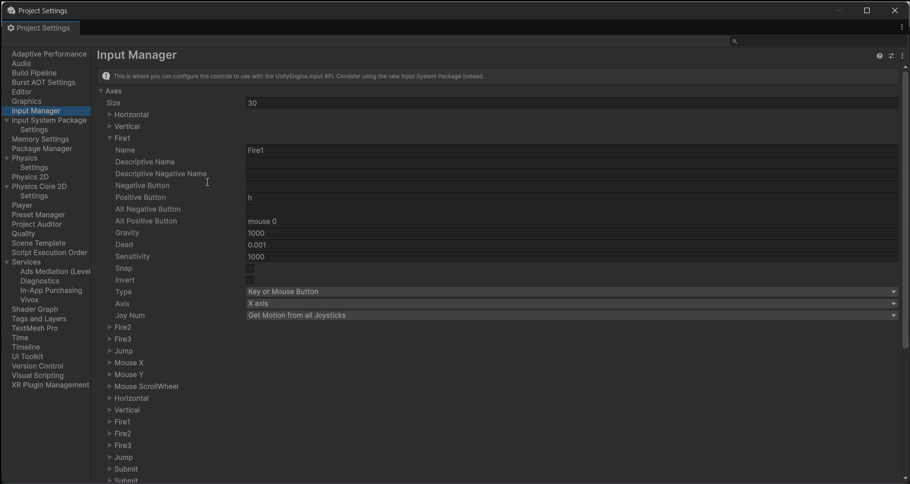

### Hito 8: Movimiento continuo con Translate (Análisis de situaciones)
Se implementó un movimiento constante en el cubo utilizando `transform.Translate()` basado en un vector direccional (`moveDirection`) y una velocidad (`speed`). A continuación, se comentan los resultados obtenidos al alterar variables en el Inspector:
* **Duplicar las coordenadas de dirección:** El cubo se mueve el doble de rápido, ya que los valores de los vectores de traslación son mayores en cada iteración.
* **Duplicar la velocidad:** El resultado visual es exactamente el mismo que el punto anterior, ya que matemáticamente el avance se multiplica por 2.
* **Velocidad menor que 1:** El avance se vuelve muy lento, actuando como un reductor del desplazamiento.
* **Posición del cubo con Y > 0:** El movimiento horizontal se produce exactamente igual, pero el objeto mantiene la altura de desplazamiento en el aire.
* **Sistema de referencia Local vs Mundial:** Al usar el sistema mundial (`Space.World`), el cubo avanza por los ejes de la escena independientemente de su rotación. Al usar el local (`Space.Self`), el avance está condicionado hacia dónde "mira" o está rotado el cubo.  
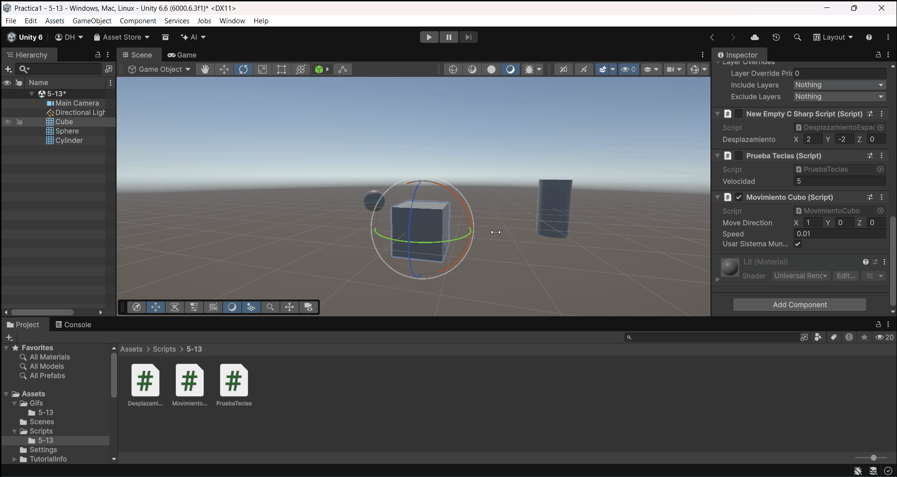

### Hito 9: Control independiente (Cubo y Esfera)
Uso de `Input.GetKey(KeyCode)` para mover dos objetos independientemente: el cubo controlado por las Flechas del teclado y la esfera controlada por las teclas WASD, aplicando movimiento solo en los ejes X y Z.  
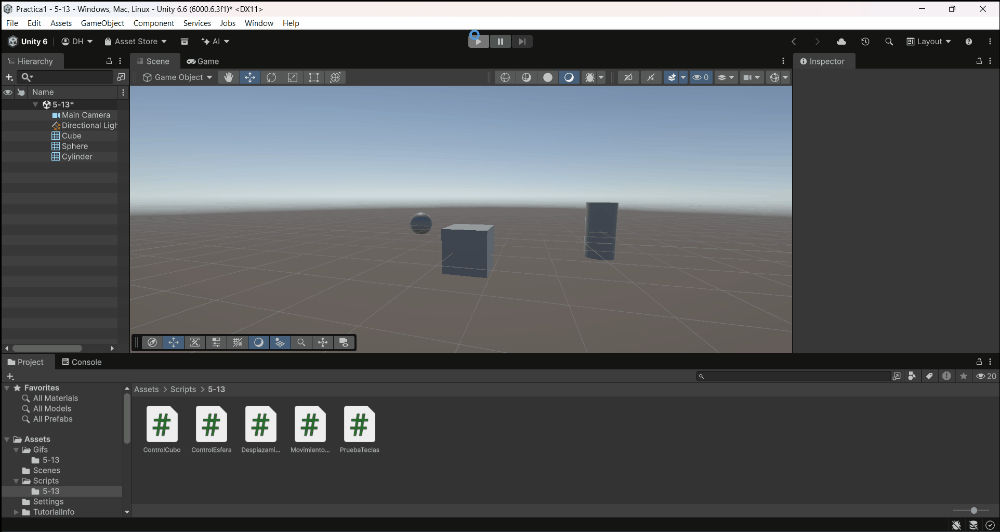

### Hito 10: Fluidez con Time.deltaTime
Evolución del hito 9. Se multiplicó el avance de la función `Translate` por `Time.deltaTime` para que el movimiento de los objetos deje de depender de la cantidad de frames por segundo del procesador (FPS) y se realice proporcionalmente al tiempo real (metros por segundo).  
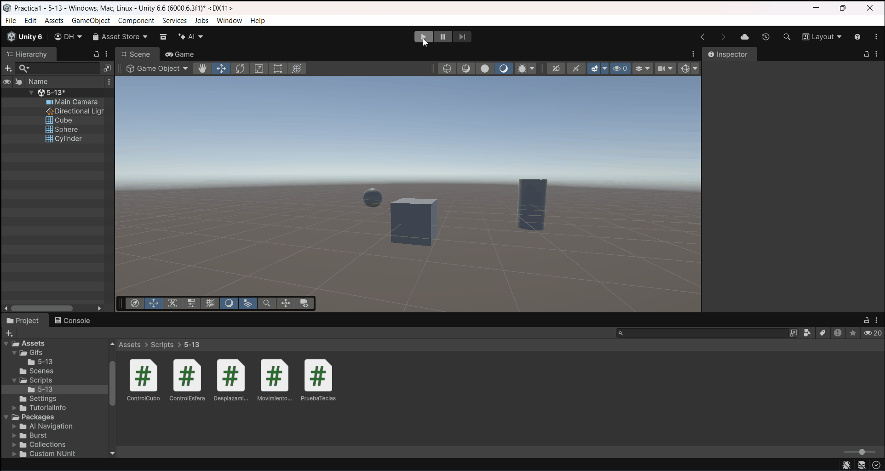

### Hito 11: Movimiento hacia objetivo (Persecución básica)
El cubo abandona el control por teclado para perseguir a la esfera. Se calcula el vector director restando el origen (cubo) al destino (esfera), se anula el eje Y para evitar variaciones de altura y se utiliza `.normalized` para asegurar que el cubo se desplace a velocidad constante y no en relación a la distancia que los separa.  
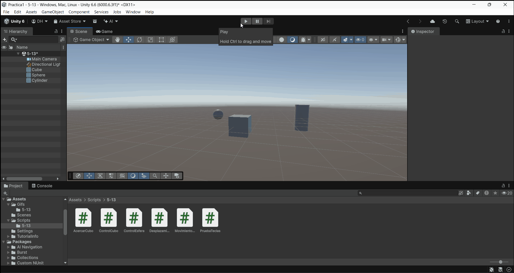

### Hito 12: Rotación hacia el objetivo (LookAt)
Se mejora el hito 11 haciendo que el cubo mire físicamente hacia la esfera antes de avanzar utilizando `transform.LookAt()`. Una vez encarándola, el cubo avanza hacia su propio eje Z positivo utilizando `transform.forward`. Se apoya en `Debug.DrawRay` para pintar un láser verde en la escena y verificar la dirección.  
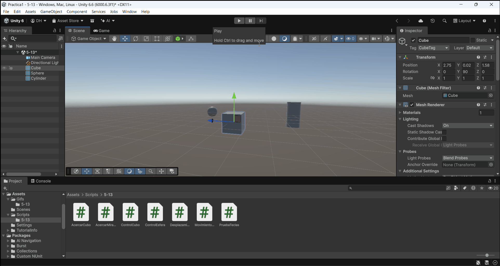

### Hito 13: Conducción de Tanque / Coche
Se separa la rotación del avance. Al pulsar las teclas horizontales, el objeto rota sobre su propio eje Y (`transform.Rotate`). Paralelamente, el objeto avanza de forma constante (o condicionado a un botón) hacia su frente usando `transform.forward`.  
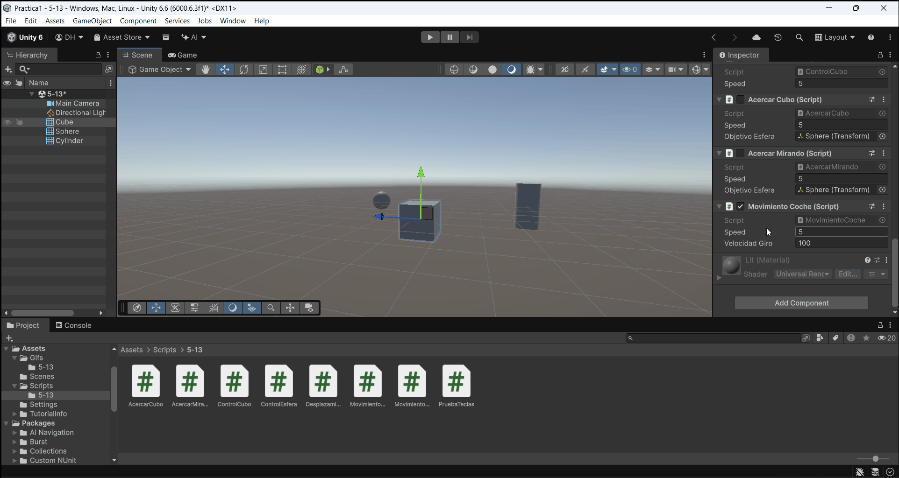
